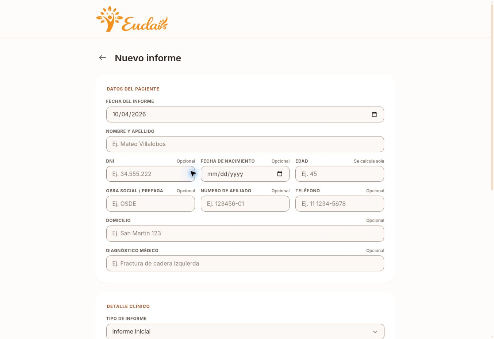

# Eudai Informes

Aplicación web para redactar informes profesionales, previsualizarlos en A4 y guardarlos como PDF mediante la impresión del navegador.

**[Abrir la aplicación](https://eudai-informes.netlify.app/#/)**

## Vista previa

| Formulario | Vista previa del documento |
| --- | --- |
|  |  |

La vista previa usa información ficticia. Este repositorio no incluye informes ni datos reales de pacientes.

## El problema

Preparar informes similares de forma repetida exige ordenar datos del paciente y del profesional, mantener una presentación consistente y recuperar trabajos anteriores. También es importante saber dónde se guardan los datos y cómo respaldarlos.

## La solución

Una herramienta centrada en el flujo completo del informe: carga de datos, validación, redacción, vista previa paginada, impresión en PDF e historial local.

## Funcionalidades

- Formulario con campos del paciente, tipo de informe, especialidad, contenido y profesional responsable.
- Validación y saneamiento de los datos antes de componer el documento.
- Vista previa A4 paginada y descarga mediante la impresión del navegador.
- Borrador automático, historial con búsqueda e importación y exportación de respaldos JSON.

## Tecnologías

HTML, CSS y JavaScript nativo con módulos ES. No requiere dependencias ni compilación. El sitio se publica como contenido estático en Netlify.

## Cómo está organizado

| Ruta | Responsabilidad |
| --- | --- |
| `index.html`, `css/app.css` | Formulario e interfaz adaptable |
| `report-template.html`, `css/report.css` | Documento A4 y estilos de impresión |
| `js/schema.js`, `js/sanitize.js`, `js/validate.js` | Campos, saneamiento y validación |
| `js/store.js` | Borrador, historial y respaldos locales |
| `js/report.js`, `js/app.js`, `js/ui.js`, `js/format.js` | Composición del informe y flujo de la interfaz |
| `_headers`, `netlify.toml` | Cabeceras y configuración del despliegue |

## Ejecutar en local

Desde la raíz del repositorio:

```bash
python3 -m http.server 8000
```

Abrí `http://localhost:8000/`. Los módulos y la plantilla necesitan servirse por HTTP; abrir `index.html` directamente no funciona.

## Alcance de esta versión

Los informes y borradores se guardan en `localStorage` del navegador. La aplicación no tiene backend ni envía informes a un servidor. Si se borran los datos del sitio o se cambia de dispositivo, los trabajos se pierden salvo que se haya exportado un respaldo. Para manejar información sensible, es necesario usar un dispositivo y perfil de navegador adecuados.

## Decisiones técnicas

La validación y el saneamiento están separados de la interfaz. Los valores del informe se insertan en la plantilla como texto, y la paginación contempla contenido largo para evitar cortes en el PDF. Las cabeceras de Netlify incluyen una política de seguridad de contenido y los recursos se sirven desde el propio sitio.

Las correcciones, decisiones de implementación y limitaciones están en las [notas técnicas](docs/NOTAS_TECNICAS.md).

---

Desarrollado por [Jeremias Hilt Peletti](https://jeremiashiltpeletti.com/).
